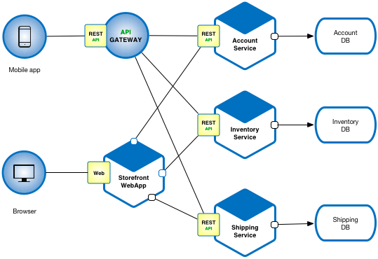

# SkyCastle Auction hub services


These software services belong to Sky Castle Auction Hub Limited (www.skycastleauctionhub.com)

NOTICE: All information contained herein is, and remains the property of Sky Castle Auction Hub ltd.

I am assuming by the time you stumble on this page you are well aware of exactly what these services do.
Nonetheless, let's try to go through all of them.


### Microservice Architecture

Microservices - also known as the microservice architecture - is an architectural style that structures an application as a collection of services that are:

* Independently deployable
* Loosely coupled
* Organized around business capabilities
* Owned by a small team

The microservice architecture enables an organization to deliver large, complex applications rapidly, frequently, reliably and sustainably - a necessity for competing and winning in today’s world.



### Services 
In this section, let's look at the services that are unique to us.
We have built 7 services so far that we support. some of them MUST be online for the rest of the system to function properly.
Here is a list of the services we have so far developed and what each on of them does.

#### Configuration service
Using org.springframework.cloud's  spring-cloud-config-server package, we have managed to decouple configuration of all our services from the services themselves.
This means that all services configurations are found in one central place. For our case, they are found on this very repository under the <a href="https://github.com/ivanupsons/OnlineAuction/tree/configs"  target="_blank">configs</a> branch.
This service makes these configurations available for the rest of other services which makes it very crucial during deployment.

This sounds like we are breaking the independence that we so claim to protect but trust me, this is a compromise we are ready to take.

With configurations in a central place, we do not have to rebuild each service each time we make a change to it's config file.

The configuration service should always be started first.

#### Discovery service
This service relies on a package called spring-cloud-starter-netflix-eureka-server which provides us amazing discovery capabilities.

What do I mean when I say discovery? you may ask your self.
In simple terms, we do not have to worry about individual IP addresses and ports on which our different services are running.
One service can have multiple instances running on different networks and ports and we do not have to give a single damn while trying to locate them.

What this service does, is it registers these services in a central place under a single name for example, AUTH-SERVICE can be registered with 
3 instances e.g 127.0.0.1:8000, 127.0.0.1:8001 and 127.0.0.1:8002 and we wouldn't get bothered.
At the gateway( we shall look at this next), we only route load balanced traffic to https://AUTH-SERVICE and our discovery service will take care of locating which instance to use. 

#### Gateway service
As it's name states, this service acts as our entry point.
It is this that we expose to the internet.
It's job is to route traffic based on given signals in the URLS being called.

For example, if a request https://auctions.skycastleauctionhub.com/auth-service/login is made, the gateway will use prefix **auth-service** to route this request to one of the instances of the authentication services that are registered on the discovery service above.
https://auctions.skycastleauctionhub.com/inventory-service/api/v1/vehicles will be routed to the inventory service etc.

The gateway also helps us filter out unwanted requests so that they do not bog our services.
It also sets a few security features like rate limiting and so on.

#### Authentication service
The definition for this one is right in it's name, it authenticates a client.
When a client wants a resource from any of our services, they are first required to be authenticated and authorized to do so.
So they will be granted an **access_token** that expires after some time. They will use this to call the rest of the services. 

This service writes each token to redis as a key with the authenticated User details as the value of this key (NOTE that this key has a set expiration time after which redis deletes it).

Each time you make a request to any of the other services, they will look up this token(key) from redis, if it exists, capture the user details and set that in spring context.
This user can now pull a resource from a service if they are allowed to.

This chosen way of doing things in redis does not come short of pitfalls.
Redis is well known for it's poor Horizontal scalling capabilities but guess what, they responded with a work-around https://redis.io/docs/management/scaling/.

If need be, we can try scaling redis basing on that.

As *"akatalekeka"*, this service also houses the logic of our 3 user roles, i.e. BUYER, SELLER, ADMIN.
These are passed down to the other services via JWT token content.

### Inventory service

This is a service that handles everything to do with products on this site.
By "products" I mean Vehicles we sell in online Auctions.

This service tracks a product from when it is registered, until sold and provides APIs for doing inventory management.


### Auctions service

The whole idea of this project is to provide online auctioning capabilities, users log onto the system, participate in live auction sessions and place bids onto a product.
Winner takes it in some cases. (refer to the SRS)
This service provides a foundation to achieve this a product from the above inventory service is tracked by it's ID under the auctions service.
These two services keep talking to each other through HTTP calls using spring-cloud-starter-openfeign while sharing information.
The service provides websocket connections to allow live Auction participation on top of other auction management actions.

It also tracks the price changes when bids are being placed on any product.

### Payments service

This service should not confuse you by its name because it only handles subscription payments.
All product actual money exchange will happen outside the system but will of course be guided by the system.
This service implements MTN and Airtel mobile money payment APIs to allow BUYERs and SELLERS quickly pay for our periodic subscription plans.

### Notification service

This service will be sending notification e.g, SMS and email.
Note that this has not yet been developed.


## Development Environment setup.
Before we go into anything else, development of this project was done using <a href="https://jdk.java.net/17/" target="_blank">java 17 JDK</a>

This project uses <a href="https://spring.io/" target="_blank">spring boot v3.0</a>

Spring boot is a very powerful Java framework for building different applications using different architectures.
It supports Microservices(which we are using), Reactive(asynchronous nonblocking), Cloud.

It basically saves you turns of hours you could have spent configuring that boring XML found in Spring.
Spring boot provides java annotation methods to allow you quickly instantiate beans in you application container.

Just before you celebrate, Spring boot also comes ready for deployment, it comes by default with embedded tomcat server which is production ready.
You can of course change this to say Jetty/Netty with a few additional configurations,

Enough with being spring boot's spokesperson, let's dive into how to prepare your dev environment,

This project uses <a href="https://maven.apache.org/" target="_blank">Maven</a> for project management i.e package management.

Of course ask for repo access permissions from Ivan or whoever will be in charge.

Clone the project using

```
% git clone https://github.com/ivanupsons/OnlineAuction.git
```
Or if you have ssh keys set, use
```
% git clone git@github.com:ivanupsons/OnlineAuction.git
```
Open this project in a recommended IDE that supports Java EE development specifically Springboot framework.
Check  out 
* <a href="https://www.jetbrains.com/idea/" target="_blank">IntellJ Idea</a> - Although it is the best, you will need to pay some many dollars for it but if you have a friend lecturer at Makerere,or student, ask them for their email and use the Educational licence.(of course they should be able to log into their mail inbox)
* <a href="https://www.eclipse.org/downloads/" target="_blank" >Eclipse</a> -  Figure out how to set this one up.
* <a href="https://spring.io/blog/2021/06/21/spring-tools-4-11-0-released" target="_blank" >Spring Suite tools IDE</a> - This is just Eclipse already configured to support spring for you and it is free of charge.


#### Running the services
You can use the IDE capabilities to run each service in debug mode e.g on IntellJ, once you open the project in it, it will set up everything for you.
Else, you can directly use maven.
Change into the project directory and execute 
```
% mvn clean && mvn install
```
These commands will make sure all dependencies are downloaded on your local maven repo and are available to the services classpaths.

Of course make sure that the database is also set up.
Each service that uses a database, i.e. auth, inventory, auctions, payments runs on its own database.
I repeat, services do not share a single database, each runs on a separate one.

The project strictly uses <a href="https://www.postgresql.org/" target="_blank">PostgreSQL</a>
It can run on PostgresQL v11 and above.

Please switch to <a href="https://github.com/ivanupsons/OnlineAuction/tree/configs"  target="_blank">configs</a> branch and look at each of the services configuration file that are name
**service-name.properties**.
These have details fo how you should set up postgres databases e.g dbName, user, password
by default they all use the default **postgres** user and password **postgres**

First create empty database for each of these products basing off the configuration files in the config branch.
Once you start the applications, JPA will create the tables for you automatically.


To start a given service, change directory to it's folder e.g 
```
% cd config-server
```
Then execute to run the service.
```
% mvn spring-boot:run
```
Do the above command for each of the services but in the order ;
* config-server 
* discovery-service
* Other services (order does not matter)

### Code changes and collaboration

In order to avoid issues, please create a new branch from where you can do your work and test it, open a pull request, and the admin will look merge that into the main branch from where our releases shall come from.
Unless you are confident with your git skills, you can straight away work on branches <a href="https://github.com/ivanupsons/OnlineAuction/tree/dev"  target="_blank">dev</a>  and <a href="https://github.com/ivanupsons/OnlineAuction/tree/frontend"  target="_blank">frontend</a> for backend and frontend development respectively.


### Deployment

Like I earlier noted, springboot comes ready for deployment. 

All you have to do at this level is package jars for each of our services and execute them.

You can use docker if you good at it.

In order to package these executable jars,

Move to the project directory (I mean the entire project not a service folder)
Execute the following command and wait for it to complete.

```
% mvn package
```

This will generate a folder named `target` in each of the services directories.
In there is a file that ends with `.jar` e.g. `inventory-service-0.0.1-SNAPSHOT.jar`

Pull that out to anywhere you want to deploy it.(Make sure the databases are setup on the host machine)
To run it on linux, use

```
% ./inventory-service-0.0.1-SNAPSHOT.jar
```
You can use Docker for this if you want, refer to https://spring.io/guides/topicals/spring-boot-docker/ to see how to do that.

The other option is you can use Linux's <a href="https://systemd.io/" target="_blank">Systemd</a> to execure these executable jar as background tasks that you can start, stop, restart and automatically restart using this service.


### Licence

This program is not free software 
NOTICE: All information contained herein is, and remains the property of Sky Castle Auction Hub Ltd.

No reproduction or copying of code classes and methods directly from this program is allowed.
